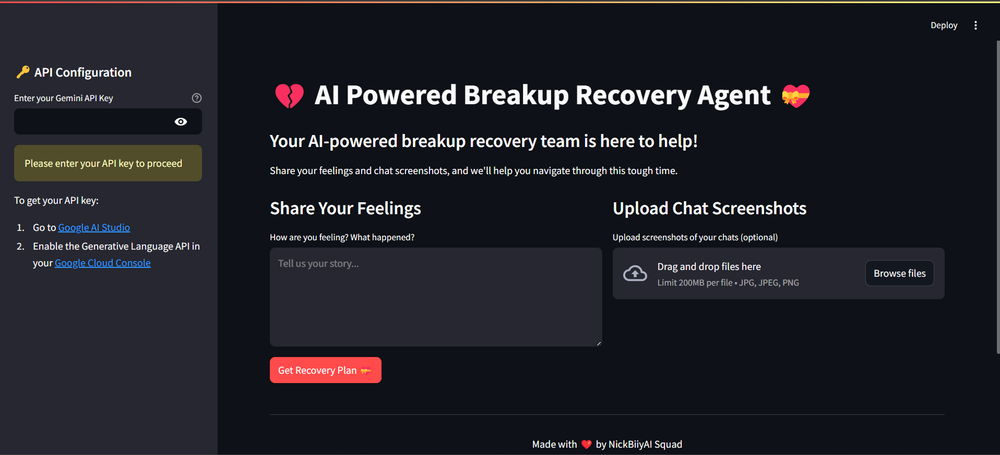

## Setup and Installation.

- clone the repo

```
git clone https://github.com/NickBwalley/AI-Powered-Breakup-Recovery-Agent.git
cd AI-Powered-Breakup-Recovery-Agent
```

- create a `venv` and `activate` it

- Install all the dependencies

```
pip install -r requirements.txt
```

- run the frontend

```
streamlit run app.py
```

- `NOTE:` You'll need to activate your `GEMINI_API_KEY` so go to this website to grab one. [GET YOUR API_KEY HERE](https://aistudio.google.com/app/apikey)

## Screenshots of the output



## MISCELLANEOUS
#### If you like this project Please don't forget to `STAR` this repo and you can follow me on LinkedIn in case you need any collaboration. 
#### I'll be happy to connect with all of you. ☺️☺️. [LINKEDIN](https://www.linkedin.com/in/nick-bwalley-49220a269/) or reach me out via email here: nickbiiybwalley@gmail.com
## LICENSE

MIT License

Copyright (c) [2025] [NickBwalley]
